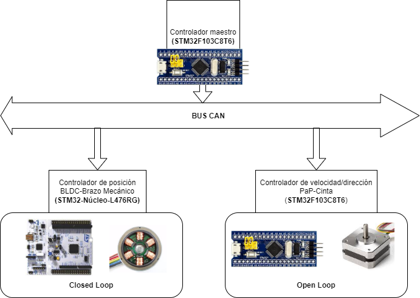

# Implementación de Control de Accionamiento Electromecánico con Motor Brushless DC y PaP.

## Objetivos

El objetivo de este proyecto es implementar un control activo de posición descentralizado para motores brushless DC y de velocidad para motor paso a paso (PaP), comandados por un controlador maestro a través de un bus CAN. Este sistema simulará una operación genérica de "pick and place" mediante un brazo robótico que deposita piezas sobre una cinta transportadora.

## Desarrollo
Primero, se adaptará el control de posicion de un accionamiento electromecánico con máquina sincrónica de corriente alterna (CA) tipo PMSM, para el control de posición de un motor brushless DC conectado al brazo mecánico mediante la técnica de control de campo orientado (FOC), tomando como referencia el trabajo integrador final desarrollado para la cátedra de Automática y Máquinas Eléctricas [1]. Luego, se realizará el control de velocidad y dirección en lazo abierto del motor paso a paso (PaP) de la cinta transportadora. Ambos controles recibirán las consignas desde un microcontrolador maestro a través de bus CAN.

El hardware que se utilizará para llevar a cabo el proyecto será:

* 1 Placa de desarrollo STM32-Núcleo-L476RG para control de posición de motor BLDC.

* 2 Placas de desarrollo STM32F103C8T6 para la implementacion del control de velocidad del PaP y el control maestro del proceso. 

* 1 Driver Pololu-A4988 para el accionamiento del motor PaP.

* 1 Puente H trifasico para el accionamiento del motor BLDC

* 1 Encoder incremental AMT102-V para realizar medición de velocidad del motor BLDC.

* 3 Resistencias Shunt para medición de corriente instántanea de fase del motor BLDC.

* 1 Final de carrera para homming de posición del brazo mecánico.

\newpage

## Referencias

1. : I. G. L. Julián, Proyecto Global Integrador: Guía de Trabajo, Control de Accionamiento de CA con Motor Sincrónico de Imanes Permanentes, UNCUYO - Ing. Mecatrónica, rev.0 2023.
